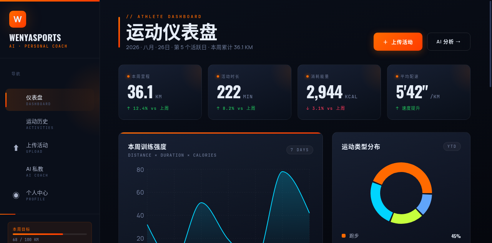

# WenYaSports - 个人运动历史记录与 AI 私教平台

基于 **FastAPI + React** 的个人运动历史记录平台，集运动数据解析、智能分析、可视化追踪与 AI 私教于一体。



## ✨ 核心特性

### 📊 个人运动历史平台
- **仪表盘**：核心指标一览（里程、时长、配速、消耗），周训练强度趋势，运动类型分布
- **活动历史**：完整运动档案，支持筛选（跑步/骑行/徒步/游泳）与多维度排序
- **AI 私教**：基于你的完整运动档案进行智能问答与个性化分析
- **个人中心**：综合能力雷达图、身体数据追踪、成就徽章、年度目标计划
- **活动详情**：心率区间、训练轨迹地图、训练建议、数据曲线

### 🧠 多智能体分析系统
- **ParserAgent**: 解析 Garmin/佳明等运动设备 `.fit` 文件
- **FeatureExtractorAgent**: 提取心率区间、配速、爬升、TRIMP 等特征
- **MemoryAgent**: 短期记忆 + SQLite 长期记忆，构建用户运动画像
- **RecommendationAgent**: 规则引擎 + LLM 混合的个性化训练建议

### 🎨 运动科技编辑风格 UI
- **深色主题**：深邃石板色背景搭配火焰橙强调色
- **运动字体**：Oswald (标题) + Manrope (正文) + JetBrains Mono (数据)
- **响应式布局**：侧边栏导航 + 主内容区，自适应多设备
- **数据可视化**：Recharts 专业图表，Leaflet 运动轨迹地图

## 🛠️ 技术栈

| 层级 | 技术 |
|-----|------|
| 后端 | Python 3.14、FastAPI、Pydantic v2、fitparse |
| 存储 | SQLite、cachetools.TTLCache |
| AI | RAG 向量检索、LLM 训练建议生成 |
| 前端 | React 19、Vite、Ant Design 6、Recharts、Leaflet |
| 测试 | pytest、FastAPI TestClient |

## 🏗️ 系统架构

```
                    ┌─────────────────────────────────────────────────────┐
  上传 FIT 文件 ───▶ │ CoordinatorAgent（协调者）                             │
                    │  1. ParserAgent        → ParsedActivity               │
                    │  2. FeatureExtractorAgent → ActivityFeatures         │
                    │  3. MemoryAgent.get_context → 用户画像/近期负荷      │
                    │  4. RecommendationAgent  → 训练建议 (规则 + LLM)       │
                    │  5. MemoryAgent.update  → 持久化 + 画像更新          │
                    └─────────────────────────────────────────────────────┘
```

## 📁 目录结构

```
WenYaSports/
├── app/                          # 后端应用
│   ├── main.py                   # FastAPI 入口
│   ├── agents/                   # 多智能体模块
│   ├── models/                   # Pydantic 数据模型
│   ├── services/                 # 业务逻辑服务
│   ├── db/                       # SQLite 数据库
│   └── api/routes.py             # REST API 路由
├── rag/                          # RAG 知识库
│   ├── base.py                   # 向量存储基类
│   ├── manager.py                # RAG 管理器
│   └── chroma_store.py           # ChromaDB 存储
├── frontend/                    # React 前端
│   └── src/
│       ├── pages/
│       │   ├── DashboardPage.jsx      # 仪表盘首页
│       │   ├── ActivitiesPage.jsx     # 运动历史列表
│       │   ├── ChatPage.jsx           # AI 私教对话
│       │   ├── ProfilePage.jsx        # 个人中心
│       │   ├── UploadPage.jsx         # 文件上传
│       │   └── ActivityDetailPage.jsx # 活动详情
│       ├── components/           # 可复用组件
│       └── index.css             # 全局样式
├── tests/                        # 测试用例
└── README.md
```

## 🚀 快速开始

### 1. 克隆仓库

```bash
git clone https://github.com/manxinwen/WenYaSports.git
cd WenYaSports
```

### 2. 启动后端服务

```bash
# 创建虚拟环境
python -m venv .venv
source .venv/bin/activate  # Linux/Mac
# .venv\Scripts\activate   # Windows

# 安装依赖
pip install -r requirements.txt

# 启动服务
uvicorn app.main:app --host 0.0.0.0 --port 8000 --reload
```

后端服务运行在 `http://127.0.0.1:8000`

API 文档: `http://127.0.0.1:8000/docs`

### 3. 启动前端应用

```bash
cd frontend
npm install
npm run dev
```

前端访问地址: `http://localhost:5173`

## 📖 使用指南

### 1. 上传运动数据

- 支持 `.fit` 格式文件（Garmin、Suunto、Polar 等设备导出）
- 拖拽或点击上传，系统自动解析并生成分析报告

### 2. 查看仪表盘

- 每周运动数据总览
- 训练强度趋势分析
- 运动类型分布

### 3. AI 私教对话

- 基于你的完整运动档案智能问答
- 个性化训练建议与方案
- 训练数据深度分析

### 4. 查看活动历史

- 完整运动档案
- 多维度筛选与排序
- 详细数据查看

### 5. 个人中心

- 综合能力雷达图
- 身体数据追踪
- 成就里程碑
- 年度目标管理

## 📡 API 接口

| 方法 | 路径 | 说明 |
|-----|------|------|
| POST | `/api/upload` | 上传 FIT 文件，返回活动 ID 与分析结果 |
| GET | `/api/activities` | 获取活动列表 |
| GET | `/api/activities/{id}` | 获取活动详情 |
| GET | `/api/user/profile` | 获取用户画像 |
| GET | `/api/chat` | AI 私教对话接口 |
| GET | `/health` | 健康检查 |

### 上传示例

```bash
curl -X POST http://localhost:8000/api/upload \
  -F "file=@activity.fit" \
  -F "user_id=your_user_id" \
  -F "session_id=session_1"
```

## 🧪 运行测试

```bash
# 后端测试
pytest tests/ -v

# 前端构建
cd frontend
npm run build
```

## ⚙️ 环境变量

| 变量 | 描述 | 默认值 |
|-----|------|--------|
| `FIT_APP_DB` | SQLite 数据库路径 | `app.db` |
| `FIT_UPLOAD_DIR` | 上传文件保存目录 | 系统临时目录 |
| `OPENAI_API_KEY` | LLM API Key（可选） | - |
| `CHROMA_PERSIST_DIR` | ChromaDB 持久化路径 | `./chroma_data` |

## 📝 开发路线图

- [x] FIT 文件解析
- [x] 特征提取与计算
- [x] 多智能体协调架构
- [x] 用户画像管理
- [x] RAG 向量检索
- [x] AI 私教对话
- [x] 仪表盘重构
- [x] 运动历史管理
- [ ] 移动端适配优化
- [ ] 多语言支持
- [ ] 数据导出功能

## 📄 开源协议

本项目基于 MIT 协议开源，欢迎 Fork、Star 和贡献代码！

---

**WenYaSports** — 让每一次运动都有迹可循，让每一份数据都有价值。
